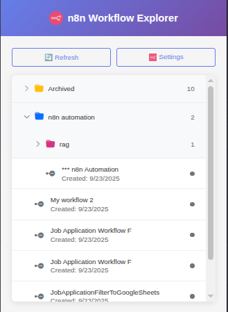
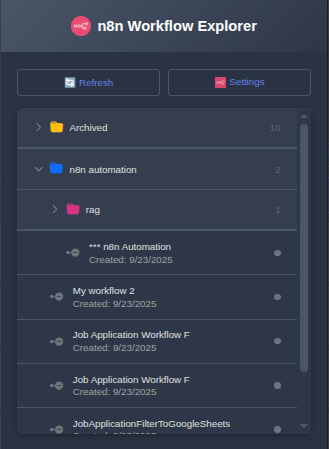

# n8n Workflow Manager Chrome Extension

🚀 A comprehensive Chrome extension for managing n8n workflows with advanced features including tag-based organization, dark mode, and customizable folder colors.

## 📸 Screenshots

<div align="center">
  <table>
    <tr>
      <td align="center">
        <h3>🌞 Light Mode</h3>
        
      </td>
      <td align="center">
        <h3>🌙 Dark Mode</h3>
        
      </td>
    </tr>
  </table>
</div>

---

## ✨ Features

### 🔧 **Easy Setup & Configuration**
- **Integrated Configuration**: In-popup settings panel (no separate windows)
- **Connection Testing**: Real-time API connection validation
- **Secure Storage**: Encrypted credential storage in Chrome's local storage
- **One-Click Setup**: Simple URL and API key configuration

### 📁 **Advanced Folder Organization**
- **Tag-based Folders**: Automatically organizes workflows by tags
- **Hierarchical Structure**: Multi-level nested folders for complex tag combinations
- **Archived Workflows**: Separate folder for archived/inactive workflows
- **Smart Grouping**: Intelligent folder creation based on tag creation dates

### 🎨 **Customizable Visual Interface**
- **10 Folder Colors**: Customize each folder with different color themes
- **Bootstrap Icons**: Professional icon system throughout the interface
- **Right-click Color Menu**: Easy folder color customization
- **Color Persistence**: Folder colors saved per user preference

### 🌙 **Dark Mode Support**
- **Full Dark Theme**: Complete dark mode implementation
- **Bootstrap Switch**: Modern toggle switch for theme switching
- **Automatic Persistence**: Theme preference saved across sessions
- **Custom Scrollbars**: Dark-themed scrollbars for better visual consistency
- **All Elements Covered**: Every UI component adapted for dark mode

### 🔄 **Smart Workflow Management**
- **Real-time Status**: Active/inactive workflow indicators
- **Quick Access**: Direct workflow opening in n8n
- **Auto-refresh**: Automatic updates when configuration changes
- **Error Handling**: Comprehensive error messages and recovery
- **Offline Viewing**: Local caching for offline access

### 🎯 **User Experience**
- **Responsive Design**: Optimized for different screen sizes
- **Smooth Animations**: CSS transitions for better interaction
- **Keyboard Navigation**: Full keyboard accessibility support
- **Context Menus**: Right-click functionality for advanced options
- **Loading States**: Visual feedback during API operations

## Installation

1. Download or clone this repository
2. Open Chrome and go to `chrome://extensions/`
3. Enable "Developer mode" in the top right
4. Click "Load unpacked" and select the extension directory
5. The extension icon will appear in your Chrome toolbar

## 🚀 Quick Start

### Initial Setup
1. Click the extension icon in your Chrome toolbar
2. Click **"Configure Connection"** button
3. In the configuration panel:
   - **n8n API URL**: Enter your n8n instance URL (e.g., `https://your-n8n-instance.com`)
   - **n8n API Key**: Enter your API key from n8n settings
   - **Dark Mode**: Toggle your preferred theme
   - Click **"Save & Test"** to validate and save

### Using the Extension
1. **Browse Workflows**: Organized automatically by tags in expandable folders
2. **Customize Colors**: Right-click folder icons to change colors
3. **Quick Access**: Click any workflow to open it directly in n8n
4. **Refresh Data**: Use the refresh button to update workflow list
5. **Settings**: Access configuration anytime via the settings button

### Dark Mode
- Toggle dark mode in the configuration panel
- Automatic theme persistence across browser sessions
- Complete UI transformation including scrollbars
- Modern Bootstrap switch interface

## 🏗️ How It Works

### 📂 Smart Folder Organization

The extension intelligently organizes workflows using a sophisticated tag-based system:

#### Folder Structure Logic
- **🗂️ Untagged Workflows**: Workflows without tags appear in a dedicated folder
- **📁 Single Tag**: Creates a folder named after the tag
- **🌳 Multi-Tag Hierarchies**: Creates nested folder structures based on tag creation dates
- **📦 Archived Workflows**: Inactive workflows grouped separately for better organization

#### Folder Color Customization
- **🎨 10 Color Themes**: Default, Primary, Success, Info, Warning, Danger, Purple, Pink, Orange, Teal
- **🖱️ Right-Click Menu**: Context menu on folder icons for color selection
- **💾 Persistent Colors**: Individual folder colors saved to local storage
- **🎯 Isolated Styling**: Parent folder colors don't affect child folders

### 📊 Example Organization

Consider workflows with these tags and statuses:

```
Workflow A: [Marketing (2024-01-01), Email (2024-01-05)] - Active
Workflow B: [Marketing (2024-01-01), Social (2024-01-10)] - Active  
Workflow C: [Support (2024-02-01)] - Inactive
Workflow D: [No tags] - Active
```

**Resulting Structure:**
```
� Marketing/ (custom blue color)
  � Email/ (custom green color)
    ✅ Workflow A (Active)
  � Social/ (custom orange color)
    ✅ Workflow B (Active)
� Archived Workflows/
  ⭕ Workflow C (Inactive)
�️ Untagged Workflows/
  ✅ Workflow D (Active)
```

### 🌙 Dark Mode Implementation

The extension features a comprehensive dark mode system:

#### Visual Transformations
- **🎨 Complete Theme**: All UI elements adapted for dark viewing
- **📜 Custom Scrollbars**: Dark-themed scrollbars for visual consistency
- **🔄 Smooth Transitions**: CSS animations for seamless theme switching
- **⚙️ Bootstrap Switch**: Modern toggle interface in settings

#### Color Adaptations
- **Background**: Light grays → Dark charcoal (#1a1a1a, #2d3748)
- **Text**: Dark colors → Light colors (#e0e0e0, #a0a0a0)
- **Inputs**: Light backgrounds → Dark inputs with proper contrast
- **Buttons**: Maintained brand colors with dark-friendly adjustments

## 🔐 Requirements

- **n8n Instance**: Accessible via HTTPS
- **API Access**: Enabled in your n8n settings
- **API Key**: Valid key with workflow read permissions

## 🔒 Privacy & Security

- All data stored locally in your browser
- No external data transmission (except to your n8n instance)
- Secure credential storage


## 🔧 Troubleshooting

### 🔌 Connection Issues
**❌ Connection Failed**
- ✅ Verify your n8n URL format: `https://your-domain.com` (no trailing slash)
- ✅ Ensure your API key is valid and has workflow read permissions
- ✅ Check if your n8n instance is accessible from your browser
- ✅ Verify CORS settings if using custom domains

**⚠️ API Authentication Errors**
- `401 Unauthorized`: Invalid API key - check your n8n settings
- `403 Forbidden`: API key lacks permissions - update key permissions  
- `404 Not Found`: Incorrect API endpoint - verify n8n URL format

### 📊 Data Display Issues
**📂 No Workflows Shown**
- 🔄 Click the **Refresh** button to reload data
- 🔍 Check browser console (F12) for JavaScript errors
- ⚙️ Verify API credentials in **Settings**
- 📋 Ensure your n8n instance has workflows created

**🎨 Folder Colors Not Saving**
- 🔄 Try refreshing the extension
- 💾 Check if Chrome storage permissions are enabled
- 🖱️ Right-click folder icons (not folder names) to access color menu

### 🌙 Dark Mode Issues
**🔄 Theme Not Switching**
- ⚙️ Access Settings and toggle the dark mode switch
- 🔄 Refresh the extension popup if needed
- 💾 Check if storage permissions are granted

**🎨 Styling Issues in Dark Mode**
- 🔄 Reload the extension completely
- 🧹 Clear Chrome extension data and reconfigure

### 🚀 Extension Loading Problems
**❌ Extension Not Loading**
- 📋 Check `chrome://extensions/` for error messages
- 📁 Ensure all files are in the correct directory structure
- 🔄 Try disabling and re-enabling the extension
- 👨‍💻 Enable "Developer mode" in Chrome extensions

**⚡ Performance Issues**
- 📊 Large workflow counts may cause slow loading
- 💾 Clear extension storage: `chrome://settings/content/all`
- 🔄 Use the refresh button instead of reopening popup frequently

### 📞 Getting Help
- 🐛 Check browser console for detailed error messages
- 📋 Note your n8n version and Chrome version when reporting issues
- 🔍 Verify the extension version in `chrome://extensions/`

## 🤝 Contributing

We welcome contributions! Here's how you can help:

### 🐛 Bug Reports
- Use GitHub Issues to report bugs
- Include Chrome version, n8n version, and error console output
- Provide steps to reproduce the issue

### ✨ Feature Requests  
- Suggest new features via GitHub Issues
- Explain the use case and expected behavior
- Consider backward compatibility

### 🔧 Development Setup
1. Clone the repository
2. Open `chrome://extensions/` in Chrome
3. Enable "Developer mode"  
4. Click "Load unpacked" and select project folder

### 📋 Guidelines
- Follow existing code style
- Test both light and dark modes
- Add clear comments for new features

## 🎯 Roadmap

### 🔮 Planned Features
- **🔍 Search Functionality**: Filter workflows by name or tags
- **📊 Statistics Dashboard**: Workflow execution stats and insights
- **⚡ Bulk Operations**: Mass workflow enable/disable/delete
- **🔔 Notifications**: Workflow execution status notifications
- **📱 Mobile Optimization**: Better mobile browser support
- **🌍 Internationalization**: Multi-language support

### 🎨 UI/UX Improvements
- **🎭 Custom Themes**: User-defined color schemes beyond dark/light
- **📋 Drag & Drop**: Reorganize folders and workflows
- **⌨️ Keyboard Shortcuts**: Hotkey navigation
- **🔄 Auto-refresh**: Configurable automatic workflow updates

## 📄 License

MIT License - see [LICENSE](LICENSE) file for details.

---

## 🎉 Acknowledgments

- **🎨 Bootstrap Icons**: Professional icon system
- **⚡ Chrome Extension APIs**: Powerful browser integration
- **🌐 n8n Community**: Inspiration and workflow automation platform
- **💝 Open Source**: Built with love for the automation community

---

**⭐ If this extension helps you manage your n8n workflows, please consider giving it a star!**
